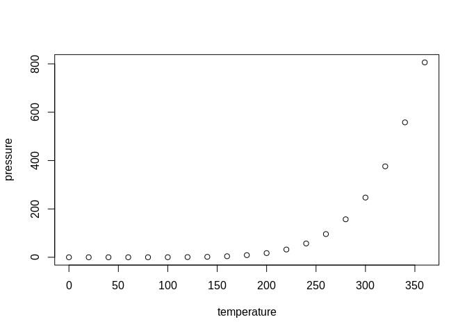

<!-- README.md is generated from README.Rmd. Please edit that file -->

# WurPackageExersice

<!-- badges: start -->

[](https://github.com/SmitsG/wur_package_exersice/actions)
<!-- badges: end -->

The goal of WurPackageExersice is to …

## Installation

You can install the development version of WurPackageExersice from
[GitHub](https://github.com/) with:

``` r
# install.packages("devtools")
devtools::install_github("SmitsG/wur_package_exersice")
```

## Example

This is a basic example which shows you how to solve a common problem:

``` r
library(WurPackageExersice)
## basic example code
```

What is special about using `README.Rmd` instead of just `README.md`?
You can include R chunks like so:

``` r
WurPackageExersice::import_excel_data(excel_data_path, sheet = "Raw")
#> Import data
#> ERROR : object 'excel_data_path' not found 
#> [1] "finally Executed"
#> NULL
```

You’ll still need to render `README.Rmd` regularly, to keep `README.md`
up-to-date. `devtools::build_readme()` is handy for this. You could also
use GitHub Actions to re-render `README.Rmd` every time you push. An
example workflow can be found here:
<https://github.com/r-lib/actions/tree/v1/examples>.

You can also embed plots, for example:



In that case, don’t forget to commit and push the resulting figure
files, so they display on GitHub and CRAN.
